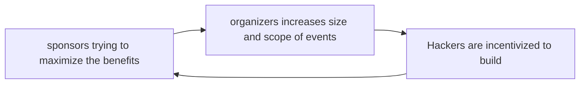

_And on perplexity of hackathon. See this on [substack](https://open.substack.com/pub/livingalone/p/i-saw-a-disstrack-dropped-at-a-hackathon?r=1z8i4s\&utm_campaign=post\&utm_medium=web\&showWelcomeOnShare=true)_

 _Cohere Toronto Office_

## feels and results.

The train station loomed, a grey monolith against the ever-darkening sky. It was half-past seven on a Sunday, and I ran late for the 20:23 Lakeshore West Train back to Hamilton. Quickly grabbing my laptops from the bags I packed for the weekend away, I hop back onto the [stream](https://x.com/i/broadcasts/1OwxWNvzRejJQ) to catch others’ presentations. It wasn’t any ordinary Sunday, but rather the demo night of [New Build](https://x.com/newsystems_/status/1828455648377327976)

Exhaustion clung to me like a second skin after 48 hours of sleep deprivation and intense focus on hacking on a project. Our team had already finished the demo, yet something gnawed at the corner of my mind. A vague unease, shapeless as the fog, settled over me. I couldn’t shake the feeling of [displacement](https://aarnphm.xyz/posts/new/../../thoughts/displacement) that slipped through my fingers, leaving the aftertaste of a half-remembered dream.

 I have done a fair shares of [hackathons](https://jzhao.xyz/posts/hackathons) in the past, yet New Build stood apart from most hackathons I have attended. New Build is **the** definition of “unc cracked tpot club” that build projects during the weekend. It was the distilled essence of Toronto’s raw talents that represents the ever-fast-growing tech scene in Canada. New Build was a multidisciplinary hackathon that combines intensive project development with team formation inspired by NBA Draft[^1]. One major feature that differentiated New from other hackathons is the draft mechanics. We knew who the team captains were. Lo and behold, yours truly was one of them.

Given the crowd of cracked and brilliant minds participating in this event, the weight of self-imposed expectations hung heavy. I felt compelled to match their prowess, not for their sake but to prove something to myself. Yet beneath it all, a voice whispered a simple desire lingering at the back of my mind - to savour the experience and craft something genuine and [quaint](https://maggieappleton.com/folk-interfaces). I had an idea in mind infused with warmth, a reflection of my inner child, free from the cold glare of corporatism.

> I want to play and build something novel!

Yet, on Saturday morning, as soon as the clock struck 08:30, my corporate-wired mind took control, drowning out any remnants of authenticity I have. We immediately got carried away into short-term optimisation[^2] of the problem statement, min-maxxing for the potential outcomes of the project. Additionally, we were fixated on the name such that we wanted to make it work.

> **We have fallen into the trap of corporatisation of hackathons**.


This mindset got to me, and it showed during the demo. The panel said nothing. No questions, no grilling. Defeat washed over me, heavy as the silence. I felt small, like one of those shuttered storefronts dotting the neighbourhood.

On the train home, I watched the city blur past - all grit, neon, and late-night diners. Something shifted, quiet as a whisper: I know my shit. Damn good, actually. The city kept moving, indifferent. And so would I.

## on hacker culture and implications of New Build.

_the following is an excerpt from [Hacking the Hackathon](https://jzhao.xyz/posts/hackathons)_

A weird thing about startup/hustle culture: We fetishise exhaustion as a badge of honour. We have collectively decided that bags under our eyes are way cooler than a new iPhone. This behaviour very much stems from Silicon Valey’s [saviorism](https://stanforddaily.com/2018/02/16/silicon-valleys-saviorism-problem/) attitude. The time-boxed nature of hackathons only serves as microcosms of this zeitgeist and compels participants to push their limits in a 24-36 hours sprint to push out marketable products.

The fundamental issue with this approach is its [reductionist](https://aarnphm.xyz/posts/new/../../thoughts/reductionism) nature. These rapid-fire development sessions rarely build upon existing knowledge or work in the field. More often than not, they ignore crucial context surrounding the complex issues they attempt to address, distilling multifaceted problems into a simple web app[^3]. This methodology prioritizes speed and novelty over depth and nuance, potentially leading to superficial innovations that fail to address root causes or consider long-term implications.

“Hackers” are makers compelled to create - not for money or fame, but for the pure joy of bringing something new to life. The congregations of craftsmen eventually led to the formation of hackerspaces such as hackathons – a kind of digital-age speakeasy for the intellectually adventurous. These spaces were initially conceived as the “third space” outside the state’s influence and the capitalist market.

Yet, these spaces often struggle to remain true to their vision without intentional intervention. The commercialisation of hackathons can be seen as an unintended consequence of their underlying financial incentives. Hackathons aren’t cheap to run, so organizers, with the best of intentions, turn to sponsorships to keep the lights on and the Red Bull flowing.

But each logo slapped on a banner chips away at the original ethos.

It’s a classic chicken-and-egg problem. Hackathons need money, but the incentive structure to foot the bill slowly morphs hackathons away from their original purposes. It is tricky, right? How do you keep the spirit of innovation and learning while all these other factors are at play?



> It's likely New Builds 2 will happen September 2025.\
> \
> If you're a company, a fund, and institution that wants to get involved to help make that happen, we can start discussing now.\
> \
> So far I know:\
> \
> \- Draft Night should move to Paradise Cinema for scale and theatrics.\
> \
> \- Grand…
>
> — V (@internetvin) [1 octobre 2024](https://twitter.com/internetvin/status/1841118814676668585?ref_src=twsrc%5Etfw)

I think organizers should emphasize the ethos of hackathons, eliminate the focus on prizes and short-term projects, and replace it with something better.

Reclaiming the design spaces means to cultivate a culture of [play](https://aarnphm.xyz/posts/new/../../thoughts/play) - a space for “for unfettered exploration which gives individuals freedom to explore ideas that might not have clear monetary values.”

```poetry language=fr
A hackathon should be the infrastructure layer so that everyone can play.
```

### implications from New Build.

New Build tackled addresses some problems and challenges pretty well, such as the [draft mechanics](https://x.com/aarnphm_/status/1839714935963607405) which introduces some [entropy](https://aarnphm.xyz/posts/new/../../thoughts/Entropy), but fell short in terms of prizes incentives.

\_K and I were chatting about how New Build felt like extended [New Office Hours](https://x.com/aarnphm_/status/1775641922029162773), which is a good first step in cultivating spaces for play\_

New Build represents what Toronto has to offer, a first step to solve the “human capital flight” (often refers as “brain drain”) in Canada.

Looking ahead, I’d love to see New Build create more space for pure play. Maybe even go full retreat-style, similar to [rabbitholeathon](https://www.rabbitholeathon.com/).

I have faith in the New Build team. They’ve got good people. And good people are the ultimate moat.

### going forward with hackathons.

As for me, I keep saying each hackathon will be my last. The 36-hour coding binges aren’t as appealing as they once were. But I said that last time too, so who knows? There’s something addictive about the energy of a good hackathon[^4]

Here’s the thing about hackathons: they don’t have to choose between being recruiting events and playgrounds for innovation. The best ones are both. But right now, the scales are tipped too far towards recruitment. It’s like optimizing for an acquisition instead of building something people want. The real magic of hackathons happens when you put hackers first. Everything else – the jobs, the networking, the sponsorships – that all follows naturally when you get the core experience right.

## to my teammates.

```poetry language=fr
    I'm obsessed with your work.
    I'm so blessed to have a chance to work with you all.

    I'm sorry that I couldn't do more,
              but overall it was a net positive.
    I wouldn't trade anything for it.

    Even though we didn't win, I'm glad that we did work on something together.

    I do hope that we would cross path again in the future.

    regards, aaron.
```

[^1]: At a conventional hackathon, one can form teams beforehand with friends or pick one team at the event for the unversed. 

[^2]: [Hackathons as Co-optation Ritual: Socializing Workers and Instituionalising Innovation in the “New” Economy](https://academicworks.cuny.edu/cgi/viewcontent.cgi?article=1575\&context=gc_pubs) by _Sharon Zukin and Max Papadantonakis_ 

[^3]: One team built AI agents to solve public policies. Per the demo, it seemed to recommend building “more police stations” to solve Moss Park’s challenges. However, it is not as simple as just “building more police stations”. The judge was pretty firm on this, but the idea was there. 

[^4]: Honestly, I only do this one because of [Tommy](https://tommytrinh.me/), tyfe. 
