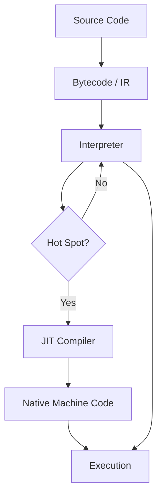

## just-in-time compiler



See also: [thoughts/jit.py](https://cdn.aarnphm.xyz/assets/thoughts/jit.py)

toy example for branch optimization:

```python
import numpy as np
import numpy.typing as npt
 
cache: list[npt.NDArray[np.float32]] = []
 
 
def dct_jit(x: npt.NDArray[np.float32]) -> npt.NDArray[np.float32]:
  global cache
  x_tuple = tuple(x)
  if x_tuple in cache:
    return cache[x_tuple]
 
  N = len(x)
  result = np.zeros(N)
  for k in range(N):
    sum_val = 0
    for n in range(N):
      sum_val += x[n] * np.cos(np.pi * k * (2 * n + 1) / (2 * N))
    result[k] = sum_val
 
  cache[x_tuple] = result
  return result
```
