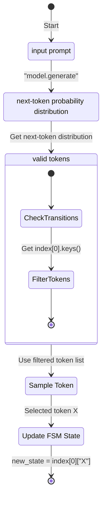

The following document describes and summarizes existing works in vLLM to improve general guided decoding performance. [^performance]

This design will largely affect how `logit_processor` are currently being handle within the vLLM architecture.

Main mega thread: [vllm-project/vllm#5423](https://github.com/vllm-project/vllm/issues/5423)

Goal:

- Improve general TPS when using guided decoding.
- Standardize logit processor interface

  [^samplingpr]
- separate compute\_logits and preparing logits into two separate steps

Orthogonal, but still goals:

- [vllm-project/vllm#5006](https://github.com/vllm-project/vllm/pull/5006)
- Logit processor plugins, similar to how vLLM plugins are handled. [vllm-project/vllm#4769](https://github.com/vllm-project/vllm/pull/4769)
- <https://github.com/mlc-ai/xgrammar>

Scope: `logit_processor`, `sampling controller interface`

## background


_reference: [vllm-project/vllm#5329](https://github.com/vllm-project/vllm/pull/5329)_

Currently, generations with FSM is super slow, even with warmup steps to initialize given FSM. This behaviour is further exemplified when running with context longer than 4096 tokens.

Additionally, all outlines logit processors are considered stateful, which slows down the model executor, given in V0 logit processors are applied [row-by-row blocking](https://github.com/vllm-project/vllm/blob/1ea291a4173a82c537ab42487e23375be4926d30/vllm/model_executor/layers/logits_processor.py#L143)

Thus comparing to sglang, vLLM v0 is currently not up to par.

## plan

- Implement [jump-ahead decoding](https://lmsys.org/blog/2024-02-05-compressed-fsm/#method-1-finite-state-machine-based) through a JSONWorker, we can then extend this to CFGWorker
- similar to how spec decode is currently implemented in V0

[**@cadedaniel**](https://github.com/cadedaniel): “tree scoring in \[spec decode] could use the same API as multi-path jump decoding.”

> [!question] How should we handle FSM per requests?
>
> - Currently, users can specify different schemas per request, which means the FSM will be compiled per request. This is suboptimal because it slows down general TTFT.
> - For most use cases, we should assume JSON schema similar to how the system prompt is currently being handled (pass during server init)

> [!question] Why should we follow the plugins system?
>
> - If going with the best options, then what is the reasoning behind supporting different backends?
> - Agree for extensibility, but seems to add additional overhead.

---

## appendix.

The following includes background information about guided generations.

### batched constrained decoding for CFG and PDA

Implemented in [mlc-ai/xgrammar](https://github.com/mlc-ai/xgrammar)

> [!quote] Quote
>
> Combine bitmask in CB to send to GPU

> [!tip] IMPORTANT
>
> operating on string level, not `token_id`

`GrammarMatcher` ⇒ FSM in xgrammar

#### questions

- byte-level automaton

overhead of token\_id ⇒ string

Token for context-independent tokens vs dependent tokens within the generation masks

async pre-compile

synchronize apply mask for CPU → GPU?

How do we apply said masks to GPU block? Zero-overhead generations?

> [!question] worst-case scenario for grammar compilation?
>
> mask gen overhead: 36 $\mu s$

> [!question] time linearly increase for batch size?
>
> parallelize for compilation.

> [!question] do we need to parallelize on vLLM?
>
> no, xgrammar parallelize it, with `pthread`

> [!question] shape of masks?
>
> bitmask, tensors of vocab size ⇒ concat with recast ⇒ GPU

> [!question] supported tokenizers?
>
> GLM yet to be supported (Nov 22nd)

> [!question] Given that detokenizer is in a separate process with vLLM, then can we stops duplicating this process?
>
> Currently with `xgrammar`: detokenizer included in mask generations.
>
> token\_id ⇒ tokens

#### future plans

- Function calling support
- Support more grammar (CFG, Python grammar)

### compressed FSM for jump-ahead tokens.

Implemented in ([Zheng et al., 2024](#bib-zheng2024sglangefficientexecutionstructured))

#### Method 1: [FSM](https://aarnphm.xyz/thoughts/constrained-decoding/../../thoughts/constrained-decoding#guided-generations-with-fsm)-based decoding

- intuition: Using FSM ([Willard & Louf, 2023](#bib-willard2023efficientguidedgenerationlarge)) to guide generations by increasing logit bias for tokens that conform to given JSON schema. This allows us to track the current state during decoding and filter out invalid tokens by applying logit bias to the output. 

- limitation: we can see that given construction of FSM requires token-level access, it can only transition the state by only _one_ token at a time, resulting in slow decoding.

#### Method 2: Interleaved-based

- intuition: breaks down JSON schemas, each containing either a chunk prefill part or constrained decoding part. They are then executed interleaved by inference system. Faster than per-token decoding given that chunked prefill components can process multiple tokens per forward pass

  See also <https://github.com/guidance-ai/guidance#guidance-acceleration> using llama.cpp as backend.

- limitation:

  - interleaved-based require custom syntax, making it less expressive compared to regex.
  - struggles to deal with tokenization boundaries due to conflicts between decode and chunked prefill segments.
  - frequent communications between interpreter and back-end adds additional overhead.

#### **_Method 3: Jump-Forward Decoding with compressed FSM_**


> [!tip] tokenization boundary handling
>
> During decoding, it is preferred to combine multiple characters into a single tokens.
>
> For example, when decoding `"Hello"` in context of JSON decoding, LLM might output the following token `"`, `He`, `llo`, `",`
>
> This may cause some strange behaviour if we combine the last `"` with `,` (this regex `"[\w\d\s]*"` with the last `,` will lead to endless decoding because this token `",` is not valid even if the LM wants to stop.)

Fix:

- implement _re-tokenization_ mechanism during jump-forward phase (append string instead of the tokens, followed with re-tokenization of the entire text) $\to$ add approximately 4% of overhead
- use a comprehensive regex to guide the decoding phase, instead of employing multiple concatenated regex

  [^coalescence]

### Coalescence

intuition: Instead of expanding to $n$ state, we can compress certain chunks into one state to reduce the size of said FSM.

 _figure 1: initial FSM state_

 _figure 2: compressed FSM state_

A way to adapt character regex to work with tokens in `outlines`:

```python
import outlines.fsm as fsm
from outlines.fsm.regex import make_deterministic_fsm, create_fsm_index_tokenizer
 
new_fsm, _ = make_deterministic_fsm(fsm)
idx, _ = create_fsm_index_tokenizer(new_fsm, tokenizer)
```



```python
idx_with_tokens = {
  state: {tokenizer.tokenizer.decode([key]): value for key, value in transitions.items()}
  for state, transitions in idx.items()
}
```

> [!note]- example
>
> ```mermaid
> stateDiagram-v2
>     direction LR
>     0 --> 2: n
>     0 --> 1: t
>     1 --> 2: a
>     2 --> 4: na
>     2 --> 3: a
>     3 --> 5: am
>     4 --> 6: me
>     5 --> 6: me
>     2 --> 6: name
>     6 --> 7: e
>     6 --> 8: c
>     7 --> 9: p
>     8 --> 9: p
>     9 --> 11: Paul
>     9 --> 12: Pa
>     9 --> 10: Jo
>     11 --> 13: aul
>     12 --> 14: ul
>     10 --> 26: o
>     26 --> 27: h
>     27 --> 14: n
>     13 --> 14: l
>     14 --> 16: s
>     14 --> 15: s
>     15 --> 17: s
>     16 --> 17: s
>     17 --> 18: a
>     17 --> 19: ag
>     18 --> 20: ge
>     19 --> 20: e
>     20 --> 21: 30
>     20 --> 22: 20
>     21 --> 24: 2
>     22 --> 24: 2
>     22 --> 23: 3
>     24 --> 25: 0
>     25 --> [*]
> ```

_note:_ each state of FSM represents a forward pass to the LM. In vanilla generation, this is essentially necessary. Thus there is no added overhead of FSM for controlling the generated outputs.

From state 2-6, we observer that there are eight different paths to get the same generations of `name`. We probably don’t need to do this, given that it will all give us result `name`

But suffice to say, we can hijack this behaviour to accelerate generations by append either of the following tokens **word** to currently generated sequence:

- \[”name”]
- \[”n”, “a”, “m”, “e”]
- \[”na”, “m”, “e”]
- \[”nam”, “e”]
- \[”n”, “am”, “e”]
- \[”n”, “ame”]
- \[”na”, “me”]
- \[”n”, “a”, “me”]

A simplified index can be shown as:

```python
simplified_index = {
    0: {'{"': 2},
    2: {"name": 6},
    6: {'":"': 9},
    9: {'Paul': 14, 'John': 14},
    14: {'","': 17},
    17: {'age': 20},
    20: {'":': 22},
    22: {'20': 24, '30': 24},
    24: {'}': 25},
}
```

That’s at least a 5x speedup over structured generations, given that out of the 9 tokens, two states are single-state transitions. Therefore we only need to call the model _twice_!!

> [!tip]- difference in sampling distribution
>
> All these paths lead to the same string and the same speedup, however they lead to potentially very different states for the LLM when it reaches state 6. That is, the strings are the same, but each path leads to a different conditional probability distribution in stage 6.
>
> 

### Guided generations with FSM.

([Willard & Louf, 2023](#bib-willard2023efficientguidedgenerationlarge)), implemented at <https://github.com/dottxt-ai/outlines>

_assumption: we are building against [autoregressive transformers models](https://aarnphm.xyz/thoughts/constrained-decoding/../../thoughts/Autoregressive-models)_

- Let $\mathcal{F} \subset \mathcal{P}(\mathcal{V})$, where $\mathcal{P}$ is the power set operator, be subset of multi-token string that ends with tokens $\text{EOS} \in \mathcal{V}$.
- Text generation tasks is to draw samples from $\mathcal{F}$

Notable _sampling_ methods include greedy decoding (generate tokens recursively with highest probability tokens), beam search (but using heuristic to find the mode of distribution) [^smc]

A pseudocode for sampling procedure is as follow:

```pseudo
\begin{algorithm}
\caption{LLM token sampling}
\begin{algorithmic}
\Function{sample}{$L$}
 \State $s \gets ()$
 \For{$i \gets 1, L$}
 \State $\alpha \gets \text{LM}(s, \theta)$
 \State Sample $s \sim \text{Categorical}(\alpha)$
 \If{$s = \text{EOS}$}
 \State \textbf{break}
 \EndIf
 \State $s \gets \text{append}(s, s)$
 \EndFor
 \State \Return $s$
\EndFunction
\end{algorithmic}
\end{algorithm}
```

Given that we are dealing with finite discrete distribution, we can then compute an un-normalized conditional distribution by applying a boolean mask $m: \mathcal{P}(\mathcal{V}) \to \{0,1\}^N$, which restricts the support of original distribution:

$$
\begin{aligned} \alpha &= \text{LM}(\tilde{S_t}, \theta) \\ \tilde{\alpha} &= m(\tilde{S_t}) \odot \alpha \\ \tilde{s_{t+1}} &\approx \text{Categorial}(\tilde{\alpha}) \end{aligned}
$$

> [!math] augmentation upon sampling algorithm
>
> ```pseudo
> \begin{algorithm}
> \caption{token sampling with masking}
> \begin{algorithmic}
> \Function{sample}{$L$}
>  \State $s \gets ()$
>  \For{$i \gets 1, L$}
>  \State $\alpha \gets \text{LM}(s, \theta)$
>  \State Construct the mask m($s$)
>  \State $\tilde{\alpha} \gets m \odot \alpha$
>  \State Sample $\tilde{s} \sim \text{Categorical}(\tilde{\alpha})$
>  \If{$\tilde{s} = \text{EOS}$}
>  \State \textbf{break}
>  \EndIf
>  \State $s \gets \text{append}(s, \tilde{s})$
>  \EndFor
>  \State \Return $s$
> \EndFunction
> \end{algorithmic}
> \end{algorithm}
> ```

> [!tip] finite automaton
>
> We define a _finite-state machine_, given by $(Q, \Sigma , \delta, q_0, F)$ [^automaton-definition] where character comprising the strings in $\mathcal{V}$ are drawn from $\Sigma$, i.e: $\mathcal{V} \in \mathcal{P}(\Sigma)$
>
>  > _FSM making for regular expression `([0-9]*)?\.?[0-9]*`_
>
> > [!note]- example illustration
> >
> > For simplicity, let the vocabulary $\mathcal{V}$ consists of strings $\{A, ., 42, .2, 1\}$
> >
> > - generations start: FSM in state 0, so it masks “A”, since it wouldn’t accepted by the FSM. Then we only sample ”.”, “42”, “.2”, “1” in this case
> > - if we sample “.2” then we advance the FSM to state 3. In this case. only “42” and “1” are valid completions, so we mask other values before sampling. If we sample “1” instead, then we advance FSM to state 1, in which case ”.”, “.42”, “.2”, and “1” are valid completions

> [!tip] determinism
>
> Looping through the vocabulary is still the biggest issue. For that, we preprocess the vocabulary using Regex’s FSM and build a index. Thus a proceeding for producing matches starting at any point in the FSM is required.

We define finding sub-sequences of FSM $M$ that accept string $v$ as follow:

```pseudo
\begin{algorithm}
\caption{Find sub-sequences of the FSM $M$ that accept the string $v$}
\begin{algorithmic}
\Function{FindSubSequences}{$M, v$}
 \State $M = (Q, \Sigma, \delta, q_0, F)$
 \State $\texttt{res} \gets ()$
 \For{$r \in \delta^{-1}(\cdot, v_0)$} \Comment{$\text{ Loop through states that read } v_0$}
 \State $p \gets (r)$
 \For{$i \gets 1, |v| - 1$} \Comment{$\text{ Walk the FSM}$}
 \If{$\delta(r, v_i) = \emptyset$} \Comment{$\text{ The FSM does not read } v_i$}
 \State $p \gets ()$
 \State \textbf{break} \Comment{$\text{ Stop walking and try the next start state}$}
 \EndIf
 \State $r \gets \delta(r, v_i)$
 \State $p \gets \text{append}(p, r)$
 \EndFor
 \State $\texttt{res} \gets \text{append}(\texttt{res}, p)$
 \EndFor
 \State \Return $\texttt{res}$
\EndFunction
\end{algorithmic}
\end{algorithm}
```

We can then define construction of $\sigma$

```pseudo
\begin{algorithm}
\caption{Construct a map from FSM states to subsets of $\mathcal{V}$}
\begin{algorithmic}
\Function{MapStatesToVocab}{$M, \mathcal{V}$}
 \State $M = (Q, \Sigma, \delta, q_0, F)$
 \State Initialize the map $\sigma$ with empty sets for each element in $Q$
 \For{$v \in \mathcal{V}$} \Comment{$\text{Loop through the vocabulary}$}
 \State $Z \gets \text{find\_sub\_sequences}(M, v)$
 \For{$z \in Z$} \Comment{$\text{Loop through state sequences accepting } v$}
 \State $\sigma(z_0) \gets \sigma(z_0) \cup v$
 \EndFor
 \EndFor
 \State \Return $\sigma$
\EndFunction
\end{algorithmic}
\end{algorithm}
```

## References

- Lew, A. K., Zhi-Xuan, T., Grand, G., & Mansinghka, V. K. (2023). _Sequential Monte Carlo Steering of Large Language Models using Probabilistic Programs_. arXiv preprint arXiv:2306.03081 [arxiv](https://arxiv.org/abs/2306.03081)
- Willard, B. T., & Louf, R. (2023). _Efficient Guided Generation for Large Language Models_. arXiv preprint arXiv:2307.09702 [arxiv](https://arxiv.org/abs/2307.09702)
- Zheng, L., Yin, L., Xie, Z., Sun, C., Huang, J., Yu, C. H., Cao, S., Kozyrakis, C., Stoica, I., Gonzalez, J. E., Barrett, C., & Sheng, Y. (2024). _SGLang: Efficient Execution of Structured Language Model Programs_. arXiv preprint arXiv:2312.07104 [arxiv](https://arxiv.org/abs/2312.07104)

[^performance]: Benchmark script can be found at [vllm-project/vllm#10046](https://github.com/vllm-project/vllm/pull/10046).

    Current RFC [vllm-project/vllm#5423](https://github.com/vllm-project/vllm/issues/5423) 

[^samplingpr]: [vllm-project/vllm#6273](https://github.com/vllm-project/vllm/pull/6273) proposed a sampling controller interface, but [**@cadedaniel**](https://github.com/cadedaniel) shares some [concerns](https://github.com/vllm-project/vllm/pull/6273#issuecomment-2243654991) wrt fast-forward tokens 

[^coalescence]: this phenomena is also known as [coalescence](https://aarnphm.xyz/thoughts/constrained-decoding/../../thoughts/constrained-decoding#coalescence) in structured generations, where it exploit deterministic structures in desired outputs to skip expensive forward pass 

[^smc]: ([Lew et al., 2023](#bib-lew2023sequentialmontecarlosteering)) recently proposes a sequential [Monte Carlo steering](https://aarnphm.xyz/thoughts/constrained-decoding/../../thoughts/Monte-Carlo). The idea is to classify causal generations as a _posteriori inference_ problem in a class of discrete probabilistic sequence models.

    See also [Feynman-Kac transformers models](https://aarnphm.xyz/thoughts/constrained-decoding/../../thoughts/Transformers#feynman-kac) 

[^automaton-definition]: [finite state machine](https://aarnphm.xyz/thoughts/constrained-decoding/../../thoughts/university/twenty-three-twenty-four/sfwr-2fa3/DFA)

    - $Q$ is a finite set of states
    - $\Sigma$ is a finite alphabet
    - $\delta: Q \times \Sigma \to Q$ is the transition function
    - $q_0 \in Q$ is the start state
    - $F \subseteq Q$ is the set of all accepted states.

