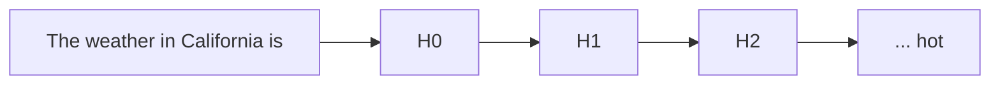
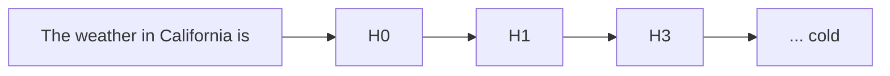

[whirlwind tour](https://www.youtube.com/watch?v=veT2VI4vHyU\&ab_channel=FAR%E2%80%A4AI), [initial exploration](https://aarnphm.xyz/thoughts/mechanistic-interpretability/../../thoughts/pdfs/tinymorph-exploration.pdf), [glossary](https://dynalist.io/d/n2ZWtnoYHrU1s4vnFSAQ519J)

> The subfield of alignment that delves into reverse engineering of a neural network, especially [LLMs](https://aarnphm.xyz/thoughts/mechanistic-interpretability/../../thoughts/LLMs)

To attack the _curse of dimensionality_, the question remains: __how do we hope to understand a function over such a large space, without an exponential amount of time?__ [^lesswrongarc]

## inference

application in the wild: [Goodfire](https://goodfire.ai/) and [Transluce](https://transluce.org/)

> [!question]+ How we would do inference with SAE?
>
> > Quick 🧵 and some of quick introspection into how they might run inference <https://t.co/1N3JrxFHSp>
> >
> > — aaron (@aarnphm\_) [25 septembre 2024](https://twitter.com/aarnphm_/status/1839016131321016380?ref_src=twsrc%5Etfw)

idea: treat SAEs as a `logit_processor`, similar to [guided decoding](https://aarnphm.xyz/thoughts/mechanistic-interpretability/../../thoughts/vllm#guided-decoding)

Current known bottleneck in vLLM:

- `logit_processor` are row-wise, or logits are processed synchronously and blocking

  [^vllm-caveats]
- no SPMD currently implemented

## steering

refers to the process of manually modifying certain activations and hidden state of the neural net to influence its outputs

For example, the following is a toy example of how a decoder-only transformers (i.e: GPT-2) generate text given the prompt “The weather in California is”



To steer to model, we modify $H_2$ layers with certain features amplifier with scale 20 (called it $H_{3}$)[^1]



One usually use techniques such as [sparse autoencoders](https://aarnphm.xyz/thoughts/mechanistic-interpretability/../../thoughts/mechanistic-interpretability#sparse-autoencoders) to decompose model activations into a set of interpretable features.

For feature [ablation](https://aarnphm.xyz/thoughts/mechanistic-interpretability/../../thoughts/mechanistic-interpretability#ablation), we observe that manipulation of features activation can be strengthened or weakened to directly influence the model’s outputs

A few examples where ([Panickssery et al., 2024](#bib-panickssery2024steeringllama2contrastive)) uses contrastive activation additions to steer Llama 2

### contrastive activation additions

intuition: using a contrast pair for steering vector additions at certain activations layers

Uses _mean difference_ which produce difference vector similar to PCA:

Given a dataset $\mathcal{D}$ of prompt $p$ with positive completion $c_p$ and negative completion $c_n$, we calculate mean-difference $v_\text{MD}$ at layer $L$ as follow:

$$
v_\text{MD} = \frac{1}{\mid \mathcal{D} \mid} \sum_{p,c_p,c_n \in \mathcal{D}} a_L(p,c_p) - a_L(p, c_n)
$$

> [!tip] implication
>
> by steering existing learned representations of behaviors, CAA results in better out-of-distribution generalization than basic supervised finetuning of the entire model.

## sparse autoencoders

<!--transclude of thoughts/sparse-autoencoder start-->

abbrev: SAE

_see also: [landspace](https://docs.google.com/document/d/1lHvRXJsbi41bNGZ_znGN7DmlLXITXyWyISan7Qx2y6s/edit?tab=t.0#heading=h.j9b3g3x1o1z4)_

Often contains one layers of MLP with few linear ReLU that is trained on a subset of datasets the main LLMs is trained on.

> empirical example: if we wish to interpret all features related to the author Camus, we might want to train an SAEs based on all given text of Camus to interpret “similar” features from Llama-3.1

> [!abstract] definition
>
> We wish to decompose a models’ activitation $x \in \mathbb{R}^n$ into sparse, linear combination of feature directions:
>
> $$
> \begin{aligned} x \sim x_{0} + &\sum_{i=1}^{M} f_i(x) d_i \\[8pt] \because \quad &d_i M \gg n:\text{ latent unit-norm feature direction} \\ &f_i(x) \ge 0: \text{ corresponding feature activation for }x \end{aligned}
> $$

Thus, the baseline architecture of SAEs is a linear autoencoder with L1 penalty on the activations:

$$
\begin{aligned} f(x) &\coloneqq \text{ReLU}(W_\text{enc}(x - b_\text{dec}) + b_\text{enc}) \\ \hat{x}(f) &\coloneqq W_\text{dec} f(x) + b_\text{dec} \end{aligned}
$$

> training it to reconstruct a large dataset of model activations $x \sim \mathcal{D}$, constraining hidden representation $f$ to be sparse

[L1 norm](https://aarnphm.xyz/thoughts/mechanistic-interpretability/../../thoughts/sparse-autoencoder/../../thoughts/university/twenty-four-twenty-five/sfwr-4ml3/tut/tut1#l1norm) with coefficient $\lambda$ to construct loss during training:

$$
\begin{aligned} \mathcal{L}(x) &\coloneqq \| x-\hat{x}(f(x)) \|_2^2 + \lambda \| f(x) \|_1 \\[8pt] &\because \|x-\hat{x}(f(x)) \|_2^2 : \text{ reconstruction loss} \end{aligned}
$$

> [!tip] intuition
>
> We need to reconstruction fidelity at a given sparsity level, as measured by L0 via a mixture of reconstruction fidelity and L1 regularization.

We can reduce sparsity loss term without affecting reconstruction by scaling up norm of decoder weights, or constraining norms of columns $W_\text{dec}$ during training

Ideas: output of decoder $f(x)$ has two roles

- detects what features acre active ⇐ L1 is crucial to ensure sparsity in decomposition
- _estimates_ magnitudes of active features ⇐ L1 is unwanted bias

### Gated SAE

_uses Pareto improvement over training to reduce L1 penalty_ ([Rajamanoharan et al., 2024](#bib-rajamanoharan2024improvingdictionarylearninggated))

Clear consequence of the bias during training is _shrinkage_ ([Sharkey, 2024](#bib-sharkey2024feature)) [^shrinkage]

Idea is to use [gated ReLU](https://aarnphm.xyz/thoughts/mechanistic-interpretability/../../thoughts/sparse-autoencoder/../../thoughts/optimization#gated-linear-units-and-variants) encoder ([Dauphin et al., 2017](#bib-dauphin2017languagemodelinggatedconvolutional); [Shazeer, 2020](#bib-shazeer2020gluvariantsimprovetransformer)):

$$
\tilde{f}(\mathbf{x}) \coloneqq \underbrace{\mathbb{1}[\underbrace{(\mathbf{W}_{\text{gate}}(\mathbf{x} - \mathbf{b}_{\text{dec}}) + \mathbf{b}_{\text{gate}}) > 0}_{\pi_{\text{gate}}(\mathbf{x})}]}_{f_{\text{gate}}(\mathbf{x})} \odot \underbrace{\text{ReLU}(\mathbf{W}_{\text{mag}}(\mathbf{x} - \mathbf{b}_{\text{dec}}) + \mathbf{b}_{\text{mag}})}_{f_{\text{mag}}(\mathbf{x})}
$$

where $\mathbb{1}[\bullet > 0]$ is the (point-wise) Heaviside step function and $\odot$ denotes element-wise multiplication.

| term                 | annotations                                                                     |
| -------------------- | ------------------------------------------------------------------------------- |
| $f_\text{gate}$      | which features are deemed to be active                                          |
| $f_\text{mag}$       | feature activation magnitudes (for features that have been deemed to be active) |
| $\pi_\text{gate}(x)$ | $f_\text{gate}$ sub-layer’s pre-activations                                     |

to negate the increases in parameters, use _weight sharing_:

Scale $W_\text{mag}$ in terms of $W_\text{gate}$ with a vector-valued rescaling parameter $r_\text{mag} \in \mathbb{R}^M$:

$$
(W_\text{mag})_{ij} \coloneqq (\exp (r_\text{mag}))_i \cdot (W_\text{gate})_{ij}
$$


_Figure 3: Gated SAE with weight sharing between gating and magnitude paths_


_Figure 4: A gated encoder become a single layer linear encoder with [JumpReLU](https://aarnphm.xyz/thoughts/mechanistic-interpretability/../../thoughts/sparse-autoencoder/../../thoughts/optimization#jumprelu)_ ([Erichson et al., 2019](#bib-erichson2019jumpreluretrofitdefensestrategy)) _activation function_ $\sigma_\theta$

### feature suppression

See also: [link](https://www.alignmentforum.org/posts/3JuSjTZyMzaSeTxKk/addressing-feature-suppression-in-saes)

Loss function of SAEs combines a MSE reconstruction loss with sparsity term:

$$
\begin{aligned} L(x, f(x), y) &= \|y-x\|^2/d + c\mid f(x) \mid \\[8pt] &\because d: \text{ dimensionality of }x \end{aligned}
$$

> the reconstruction is not perfect, given that only one is reconstruction. **For smaller value of $f(x)$, features will be suppressed**

> [!note]- illustrated example
>
> consider one binary feature in one dimension $x=1$ with probability $p$ and $x=0$ otherwise. Ideally, optimal SAE would extract feature activation of $f(x) \in \{0,1\}$ and have decoder $W_d=1$
>
> However, if we train SAE optimizing loss function $L(x, f(x), y)$, let say encoder outputs feature activation $a$ if $x=1$ and 0 otherwise, ignore bias term, the optimization problem becomes:
>
> $$
> \begin{aligned} a &= \argmin p * L(1,a,a) + (1-p) * L(0,0,0) \\ &= \argmin (1-a)^2 + \mid a \mid * c \\ &= \argmin a^2 + (c-2) *a +1 \end{aligned} \Longrightarrow \boxed{a = 1-\frac{c}{2}}
> $$

> [!question]+ How do we fix feature suppression in training SAEs?
>
> introduce element-wise scaling factor per feature in-between encoder and decoder, represented by vector $s$:
>
> $$
> \begin{aligned} f(x) &= \text{ReLU}(W_e x + b_e) \\ f_s(x) &= s \odot f(x) \\ y &= W_d f_s(x) + b_d \end{aligned}
> $$

[Lien vers l'original](https://aarnphm.xyz/thoughts/mechanistic-interpretability/../../thoughts/sparse-autoencoder)

<!--transclude of thoughts/sparse-autoencoder end-->

## sparse crosscoders

<!--transclude of thoughts/sparse-crosscoders start-->

> [!tip] maturity
>
> a research preview from Anthroppic and this is pretty much still a work in progress

see also [reproduction on Gemma 2B](https://colab.research.google.com/drive/124ODki4dUjfi21nuZPHRySALx9I74YHj?usp=sharing) and [github](https://github.com/ckkissane/crosscoder-model-diff-replication)

A variant of [sparse autoencoder](https://aarnphm.xyz/thoughts/mechanistic-interpretability/../../thoughts/sparse-crosscoders/../../thoughts/sparse-autoencoder) where it reads and writes to multiple layers ([Lindsey et al., 2024](#bib-lindsey2024sparsecrosscoders))

Crosscoders produces _shared features across layers and even models_

## motivations

Resolve:

- cross-layer features: resolve cross-layer superposition

- circuit simplification: remove redundant features from analysis and enable jumping across training many uninteresting identity circuit connections

- model diffing: produce shared sets of features across models. This also introduce one model across training, and also completely independent models with different architectures.

### cross-layer [superposition](https://aarnphm.xyz/thoughts/mechanistic-interpretability/../../thoughts/sparse-crosscoders/../../thoughts/mechanistic-interpretability#superposition-hypothesis)

 _given the additive properties of transformers’ residual stream, **adjacent layers** in larger transformers can be thought as “almost parallel”_

> [!tip]- intuition
>
> In basis of superposition hypothesis, a feature is a linear combinations of neurons at any given layers.
>
> 


 _if we think of adjacent layers as being “almost parallel branches that potentially have superposition between them”, then we can apply dictionary learning jointly [^jointlysae]_

### persistent features and complexity

Current drawbacks of sparse autoencoders is that we have to train it against certain activations layers to extract features. In terms of the residual stream per layers, we end up having lots of duplicate features across layers.

> Crosscoders can simplify the circuit _given that we use an appropriate architecture_ [^risks]

## setup.

> Autoencoders and transcoders as special cases of crosscoders.
>
> - autoencoders: reads and predict the same layers
> - transcoders: read from layer $n$ and predict layer $n+1$

Crosscoder read/write to many layers, subject to causality constraints.

> [!math]+ crosscoders
>
> Let one compute the vector of feature activation $f_(x_j)$ on data point $x_j$ by summing over contributions of activations of different layers $a^l(x_j)$ for layers $l \in L$:
>
> $$
> \begin{aligned} f(x_j) &= \text{ReLU}(\sum_{l\in L}W_{\text{enc}}^l a^l(x_j) + b_{\text{enc}}) \\[8pt] &\because W^l_{\text{enc}} : \text{ encoder weights at layer } l \\[8pt] &\because a^l(x_j) : \text{ activation on datapoint } x_j \text{ at layer } l \\ \end{aligned}
> $$

We have loss

$$
L = \sum_{l\in L} \|a^l(x_j) - a^{l^{'}}(x_j)\|^2 + \sum_{l\in L}\sum_i f_i(x_j) \|W^l_{\text{dec,i}}\|
$$

and regularization can be rewritten as:

$$
\sum_{l\in L}\sum_{i} f_i(x_j) \|W^l_{\text{dec,i}}\| = \sum_{i} f_i(x_j)(\displaystyle\sum_{l \in L} \|W^l_\text{dec,i}\|)
$$

_weight of L1 regularization penalty by L1 norm of per-layer decoder weight norms_ $\sum\limits{l\in L} \|W^l_\text{dec,i}\|$ [^l2weightnorm]

We use L1 due to

- baseline loss comparison: L2 exhibits lower loss than sum of per-layer SAE losses, as they would effectively obtain a loss “bonus” by spreading features across layers

- _layer-wise sparsity surfaces layer-specific features_: based on empirical results of [model diffing](https://aarnphm.xyz/thoughts/mechanistic-interpretability/../../thoughts/sparse-crosscoders/../../thoughts/sparse-crosscoders#model-diffing), that L1 uncovers a mix of shared and model-specific features, whereas L2 tends to uncover only shared features.

## variants


good to explore:

1. strictly causal crosscoders to capture MLP computation and treat computation performed by attention layers as linear
2. combine strictly causal crosscoders for MLP outputs without weakly causal crosscoders for attention outputs
3. interpretable attention replacement layers that could be used in combination with strictly causal crosscoders for a “replacement model”

## model diffing

see also: [model stiching](https://aarnphm.xyz/thoughts/mechanistic-interpretability/../../thoughts/sparse-crosscoders/../../thoughts/model-stiching) and [SVCCA](https://aarnphm.xyz/thoughts/mechanistic-interpretability/../../thoughts/sparse-crosscoders/../../thoughts/SVCCA)

> ([Laakso & Cottrell, 2000](#bib-doi:10.1080/09515080050002726)) proposes compare [representations](https://aarnphm.xyz/thoughts/mechanistic-interpretability/../../thoughts/sparse-crosscoders/../../thoughts/representations) by transforming into representations of distances between data points. [^sne]

## questions

> How do features change over model training? When do they form?

> As we make a model wider, do we get more features? or they are largely the same, packed less densely?

[Lien vers l'original](https://aarnphm.xyz/thoughts/mechanistic-interpretability/../../thoughts/sparse-crosscoders)

<!--transclude of thoughts/sparse-crosscoders end-->

## superposition hypothesis

> [!abstract]+ tl/dr
>
> phenomena when a neural network represents _more_ than $n$ features in a $n$-dimensional space

> Linear representation of neurons can represent more features than dimensions. As sparsity increases, model use superposition to represent more [features](https://aarnphm.xyz/thoughts/mechanistic-interpretability/../../thoughts/mechanistic-interpretability#features) than dimensions.
>
> neural networks “want to represent more features than they have neurons”.

When features are sparsed, superposition allows compression beyond what linear model can do, at a cost of interference that requires non-linear filtering.

reasoning: “noisy simulation”, where small neural networks exploit feature sparsity and properties of high-dimensional spaces to approximately simulate much larger much sparser neural networks

In a sense, superposition is a form of **lossy [compression](https://aarnphm.xyz/thoughts/mechanistic-interpretability/../../thoughts/Compression)**

### importance

- sparsity: how _frequently_ is it in the input?

- importance: how useful is it for lowering loss?

### over-complete basis

_reasoning for the set of $n$ directions [^direction]_

## features

> A property of an input to the model

When we talk about features ([Elhage et al., 2022, p. see “Empirical Phenomena”](#bib-elhage2022superposition)), the theory building around several observed empirical phenomena:

1. Word Embeddings: have direction which corresponding to semantic properties ([Mikolov et al., 2013](#bib-mikolov-etal-2013-linguistic)). For example:
   ```prolog
   V(king) - V(man) = V(monarch)
   ```
2. Latent space: similar vector arithmetics and interpretable directions have also been found in generative adversarial network.

We can define features as properties of inputs which a sufficiently large neural network will reliably dedicate a neuron to represent ([Elhage et al., 2022, p. see “Features as Direction”](#bib-elhage2022superposition))

## ablation

> refers to the process of removing a subset of a model’s parameters to evaluate its predictions outcome.

idea: deletes one activation of the network to see how performance on a task changes.

- zero ablation or _pruning_: Deletion by setting activations to zero
- mean ablation: Deletion by setting activations to the mean of the dataset
- random ablation or _resampling_

## residual stream


residual stream $x_{0}$ has dimension $\mathit{(C,E)}$ where

- $\mathit{C}$: the number of tokens in context windows and
- $\mathit{E}$: embedding dimension.

[Attention](https://aarnphm.xyz/thoughts/mechanistic-interpretability/../../thoughts/Attention) mechanism $\mathit{H}$ process given residual stream $x_{0}$ as the result is added back to $x_{1}$:

$$
x_{1} = \mathit{H}{(x_{0})} + x_{0}
$$

## grokking

See also: [writeup](https://www.alignmentforum.org/posts/N6WM6hs7RQMKDhYjB/a-mechanistic-interpretability-analysis-of-grokking), [code](https://colab.research.google.com/drive/1F6_1_cWXE5M7WocUcpQWp3v8z4b1jL20), [circuit threads](https://transformer-circuits.pub/2022/in-context-learning-and-induction-heads/index.html)

> A phenomena discovered by ([Power et al., 2022](#bib-power2022grokkinggeneralizationoverfittingsmall)) where small algorithmic tasks like modular addition will initially memorise training data, but after a long time ti will suddenly learn to generalise to unseen data

> [!tip] empirical claims
>
> related to phase change

## References

- Dauphin, Y. N., Fan, A., Auli, M., & Grangier, D. (2017). _Language Modeling with Gated Convolutional Networks_. arXiv preprint arXiv:1612.08083 [arxiv](https://arxiv.org/abs/1612.08083)
- Erichson, N. B., Yao, Z., & Mahoney, M. W. (2019). _JumpReLU: A Retrofit Defense Strategy for Adversarial Attacks_. arXiv preprint arXiv:1904.03750 [arxiv](https://arxiv.org/abs/1904.03750)
- Rajamanoharan, S., Conmy, A., Smith, L., Lieberum, T., Varma, V., Kramár, J., Shah, R., & Nanda, N. (2024). _Improving Dictionary Learning with Gated Sparse Autoencoders_. arXiv preprint arXiv:2404.16014 [arxiv](https://arxiv.org/abs/2404.16014)
- Sharkey, L. (2024). _Addressing Feature Suppression in SAEs_. AI Alignment Forum. [\[post\]](https://www.alignmentforum.org/posts/3JuSjTZyMzaSeTxKk/addressing-feature-suppression-in-saes)
- Shazeer, N. (2020). _GLU Variants Improve Transformer_. arXiv preprint arXiv:2002.05202 [arxiv](https://arxiv.org/abs/2002.05202)
- Gorton, L. (2024). _The Missing Curve Detectors of InceptionV1: Applying Sparse Autoencoders to InceptionV1 Early Vision_. arXiv preprint arXiv:2406.03662 [arxiv](https://arxiv.org/abs/2406.03662)
- Laakso, A., & Cottrell, G. (2000). Content and cluster analysis: Assessing representational similarity in neural systems. _Philosophical Psychology_, _13_(1), 47–76. <https://doi.org/10.1080/09515080050002726>
- Lindsey, J., Templeton, A., Marcus, J., Conerly, T., Batson, J., & Olah, C. (2024). Sparse Crosscoders for Cross-Layer Features and Model Diffing. _Transformer Circuits Thread_. [\[link\]](https://transformer-circuits.pub/2024/crosscoders/index.html)
- Elhage, N., Hume, T., Olsson, C., Schiefer, N., Henighan, T., Kravec, S., Hatfield-Dodds, Z., Lasenby, R., Drain, D., Chen, C., Grosse, R., McCandlish, S., Kaplan, J., Amodei, D., Wattenberg, M., & Olah, C. (2022). Toy Models of Superposition. _Transformer Circuits Thread_. [\[link\]](https://transformer-circuits.pub/2022/toy_model/index.html)
- Mikolov, T., Yih, W., & Zweig, G. (2013). Linguistic Regularities in Continuous Space Word Representations. In L. Vanderwende, H. Daumé III, & K. Kirchhoff (Eds.), _Proceedings of the 2013 Conference of the North American Chapter of the Association for Computational Linguistics: Human Language Technologies_ (pp. 746–751). Association for Computational Linguistics. <https://aclanthology.org/N13-1090>
- Panickssery, N., Gabrieli, N., Schulz, J., Tong, M., Hubinger, E., & Turner, A. M. (2024). _Steering Llama 2 via Contrastive Activation Addition_. arXiv preprint arXiv:2312.06681 [arxiv](https://arxiv.org/abs/2312.06681)
- Power, A., Burda, Y., Edwards, H., Babuschkin, I., & Misra, V. (2022). _Grokking: Generalization Beyond Overfitting on Small Algorithmic Datasets_. arXiv preprint arXiv:2201.02177 [arxiv](https://arxiv.org/abs/2201.02177)

[^lesswrongarc]: good read from [Lawrence C](https://www.lesswrong.com/posts/6FkWnktH3mjMAxdRT/what-i-would-do-if-i-wasn-t-at-arc-evals#Ambitious_mechanistic_interpretability) for ambitious mech interp. 

[^vllm-caveats]: [the benchmark](https://github.com/vllm-project/vllm/pull/10046) was run against `vllm#0.6.3.dev236+g48138a84`, with all configuration specified in the pull request. 

[^1]: An example steering function can be:

    $$
    H_{3} = H_{2} + \text{steering\_strength} * \text{SAE}.W_{\text{dec}}[20] * \text{max\_activation}
    $$

     


[^shrinkage]: If we hold $\hat{x}(\bullet)$ fixed, thus L1 pushes $f(x) \to 0$, while reconstruction loss pushes $f(x)$ high enough to produce accurate reconstruction.

    An optimal value is somewhere between.

    However, rescaling the [shrink](https://aarnphm.xyz/thoughts/mechanistic-interpretability/../../thoughts/sparse-autoencoder/../../thoughts/mechanistic-interpretability#feature-suppression) feature activations ([Sharkey, 2024](#bib-sharkey2024feature)) is not necessarily enough to overcome bias induced by L1: a SAE might learnt sub-optimal encoder and decoder directions that is not improved by the fixed. 

[^jointlysae]: ([Gorton, 2024](#bib-gorton2024missingcurvedetectorsinceptionv1)) denotes that cross-branch superposition is significant in interpreting models with parallel branches (InceptionV1) 

[^risks]: causal description it provides likely differs from that of the underlying model. 

[^l2weightnorm]: $\|W_\text{dec,i}^l\|$ is the L2 norm of a single feature’s decoder vector at a given layer.

    In principe, one might have expected to use L2 norm of per-layer norm $\sqrt{\sum_{l \in L} \|W_\text{dec,i}^l\|^2}$ 

[^sne]: Chris Colah’s [blog post](https://colah.github.io/posts/2015-01-Visualizing-Representations/) explains how t-SNE can be used to visualize collections of networks in a function space. 

[^direction]: Even though features still correspond to directions, the set of interpretable direction is larger than the number of dimensions 
